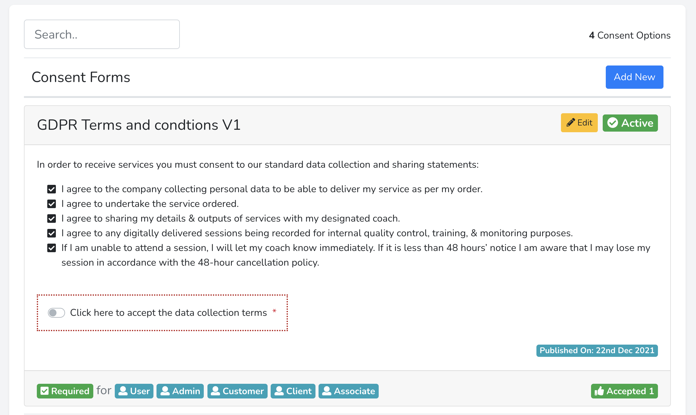
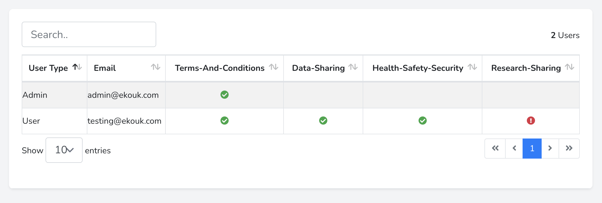
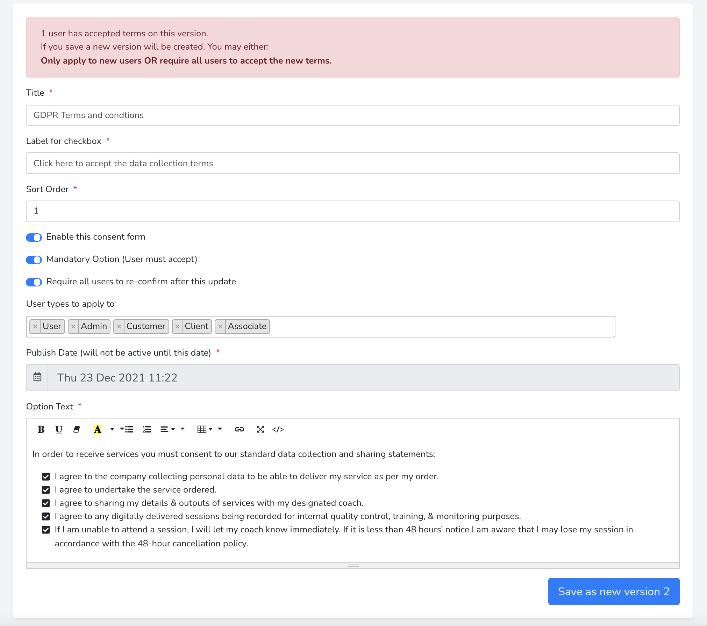

# LaraConsent


This module provides versioned user consent terms and conditions which must be accepted to allow the user to continue using the application.

When a new version is published you may optionally require existing users to accept the new terms or only apply to new users.

Once a user has accepted terms on a specific version, that version is locked and may not be changed ensuring that users and the organisation will always retain a history of accepted terms.

A consent option may be applied to any user guard allowing clients and admins to require different terms.
Set user models to be used in config file options.  In each user model inclue the HasConsent Trait.

A consent option may also be used to signup for newsletters.  Event hooks are provided which can be used to trigger subscribe / unsubscribe actions.
See Events section below.



An index view of all accepted and declined terms is included:-



Consent editor defaults to the free summernote editor but may be switched to froala editor (licence needed) in the config file.
Consent forms may be set to be published in the future and will be automatically made available on the day.




## Installation

Via Composer

``` bash
composer require ekoukltd/laraconsent
```
Publish the configuration options to customise routing.
``` bash
php artisan vendor:publish --provider="Ekoukltd\LaraConsent\LaraConsentServiceProvider" --tag="laraconsent.config"
```

For better presentation of index pages, Yarjabox Datatables is included
For this to work jQuery and bootstrap must be installed:-

Typical requirements
``` bash
 npm i jquery bootstrap@4.6.1 select2 datatables.net-bs4  datatables.net-responsive datatables.net-responsive-bs4 datatables.net-scroller-bs4
 ```


Or to allow printing tables to PDF, Excel or CSV, include buttons and JS PDF maker
``` bash
 npm i jquery bootstrap@4.6.1 select2 datatables.net-bs4 datatables.net-buttons-bs4 datatables.net-responsive datatables.net-responsive-bs4 datatables.net-scroller-bs4 jszip pdfmake
 ```

Bootstrap 4 & Bootstrap 5 templates are included

Publish views to directory /resources/views/vendor/ekoukltd & /resources/views/vendor/datatables
``` bash
php artisan vendor:publish --provider="Ekoukltd\LaraConsent\LaraConsentServiceProvider" --tag="laraconsent.views"
```
These views have been made using the Laravel 8 Breeze template format and include widgets which can be easily included into your own templates

Then publish the JS and CSS assets and translations
``` bash
php artisan vendor:publish --provider="Ekoukltd\LaraConsent\LaraConsentServiceProvider" --tag="laraconsent.assets"
```

Check the ```resources/assets/laraconsent/sass/laraconsent.scss``` file and remove any css modules you may already have.

And the ```resources/assets/laraconsent/js/imports.js``` file and remove any already included js modules.

Update webpack.mix.js to compile our CSS
``` javascript
.sass('resources/assets/laraconsent/sass/laraconsent.scss', 'public/css')
.copy('resources/assets/laraconsent/sass/laraconsent_print.css', 'public/css')
```

Then update your resources/js/app.js to load JS assets:-
``` javascript
import Laraconsent from "../assets/laraconsent/js/laraconsent";
```

and ensure the app.js file is included in webpack.mix.js
``` javascript
.js('resources/js/app.js', 'public/js')
```

Then on the cli, compile the assets
``` bash
npm run dev
```

Run Migrations:-
``` bash
php artisan migrate
```
Two database tables will be created:-
* consent_options
* consentables

consent_options stores a versioned history of each consent form and consentables records each users consent form interaction history.

## Force users to accept consent 
To redirect a user to accept consent page if one is outstanding, update your App\Http\Kernel.php  'web' middlewaregroup to include:-
```\Ekoukltd\LaraConsent\Http\Middleware\ForceRedirectToUnapprovedConsents::class```

##Authentication
User routes should be available to any logged in user.  

In the config\laraconsent.php file make sure to include auth:guardname of required guards that should be able to view their consent
``` php
'prefix'     => 'user-consent',
'middleware' => ['web','auth:admin,web']
```
## Translations
All phrases may be updated in the translation files:-
``` bash
resources/lang/vendor/laraconsent/en/admin.php
resources/lang/vendor/laraconsent/en/user.php
resources/lang/vendor/laraconsent/en.json
```

## Events
When an individual consent is given or denied a ConsentUpdated event is triggered.
When all consents have been saved the ConsentUpdatedComplete event is triggered.

Use ConsentUpdated event to trigger an action on update of a specific consent form.
Use ConsentUpdatedComplete event to trigger an action with all of the completed forms.

Customise actions in your EventServiceProvider.

These have been added by default:-

``` php
use Ekoukltd\LaraConsent\Events\ConsentsUpdatedComplete;
use Ekoukltd\LaraConsent\Listeners\NotifyConsentsUpdated;
use Ekoukltd\LaraConsent\Events\ConsentUpdated;
use Ekoukltd\LaraConsent\Listeners\LogConsentUpdated;

class EventServiceProvider extends ServiceProvider
{
    protected $listen = [
        //Triggered after each consent option is saved.
        ConsentUpdated::class => [
            //Add something to the log file.
            LogConsentUpdated::class,
            //Add update mailchimp subscription event here
        ],
        //Triggered after all consent options have been saved
        ConsentsUpdatedComplete::class => [
            //Sends email to user with copy of the consents
            NotifyConsentsUpdated::class
            ]
    ];
```


## Usage

URL's may be customised in the config file.  
Here you may also include your own middleware to restrict access the admin routes
```php
    //Grouping of admin web routes
    'routes'     => [
        'admin' => [
            //Admin web routes should only be available to admins
            'prefix'     => 'consent-admin',
            'middleware' => ['web','auth']
        ],
        'user'  => [
            //User routes should be available to any logged in user
            'prefix'     => 'consent',
            'middleware' => ['web']
        ],
    ],
```
### Admin Routes
|Method|URL|Named Route|
|---|---|---|
|GET|consent-admin|consent-admin.index|
|GET|consent-admin/create|consent-admin.create|
|POST|consent-admin/save|consent-admin.store|
|GET|consent-admin/submitted|consent-admin.submitted|
|GET|consent-admin/{consentOption}|consent-admin.show|
|PUT|consent-admin/{consentOption}|consent-admin.update|
|GET|consent-admin/{consentOption}/edit|consent-admin.edit|
|POST|consent-admin/{consentOption}/toggle|consent-admin.toggle|

### User Routes
|Method|URL|Named Route|
|---|---|---|
|GET|user-consent/my-consents|user-consent.show|
|GET|user-consent/print|user-consent.print|
|POST|user-consent/request|user-consent.store|
|GET|user-consent/request|user-consent.request|

## Change log

Please see the [changelog](changelog.md) for more information on what has changed recently.

## Testing

``` bash
composer test
```

## Contributing

Please see [contributing.md](contributing.md) for details and a todolist.

## Security

If you discover any security related issues, please email lee@ekouk.com instead of using the issue tracker.

## Credits

- [Lee Evans][link-author]
- [All Contributors][link-contributors]

## License

MIT. Please see the [license file](license.md) for more information.

[ico-version]: https://img.shields.io/packagist/v/ekoukltd/laraconsent.svg?style=flat-square
[ico-downloads]: https://img.shields.io/packagist/dt/ekoukltd/laraconsent.svg?style=flat-square
[ico-travis]: https://img.shields.io/travis/ekoukltd/laraconsent/master.svg?style=flat-square
[ico-styleci]: https://styleci.io/repos/12345678/shield

[link-packagist]: https://packagist.org/packages/ekoukltd/laraconsent
[link-downloads]: https://packagist.org/packages/ekoukltd/laraconsent
[link-travis]: https://travis-ci.org/ekoukltd/laraconsent
[link-styleci]: https://styleci.io/repos/12345678
[link-author]: https://github.com/ekoukltd
[link-contributors]: ../../contributors
